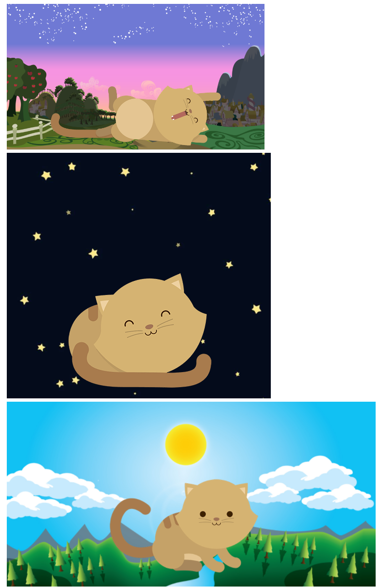

# Reto de Código - Kitten

* **Track:** _Common Core_
* **Curso:** _Crea tu propia red social_
* **Unidad:** _La web desde un móvil_

***

## Objetivo

Este reto consiste en crear una página web donde se muestre un paisaje y un gatito diferente a medida que la ventana del navegador se haga más pequeña.

## Especificaciones

* Se presentan tres vistas: desktop, tablet y mobile. La vista desktop inicia a partir de min-width: 992px, la vista tablet inicia a partir de min-width: 768px, y la vista mobile por defecto hasta llegar a un width de: 767px.
* Se utiliza un diseño flexible basado en un sistema de rejilla (grid) y media queries.
* El archivo index.html contiene la estructura de la página, y se enlaza con dos archivos: main.css y grid.css.
* En la carpeta “css” se almacenan dos archivos: main.css usado para dar estilo y diseño a la página, y grid.css usado para el sistema de rejilla (grid).
* En la carpeta “assets” se almacenan las imágenes utilizadas en el archivo html (images) y en el Readme.md (docs).

La estructura de la página es la siguiente:

